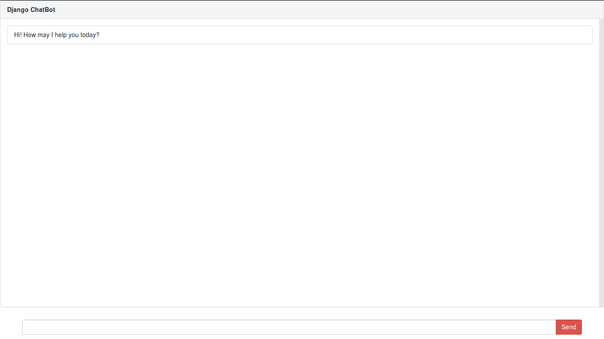
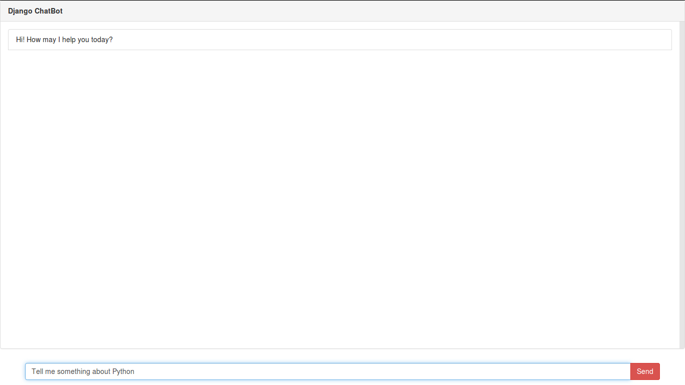
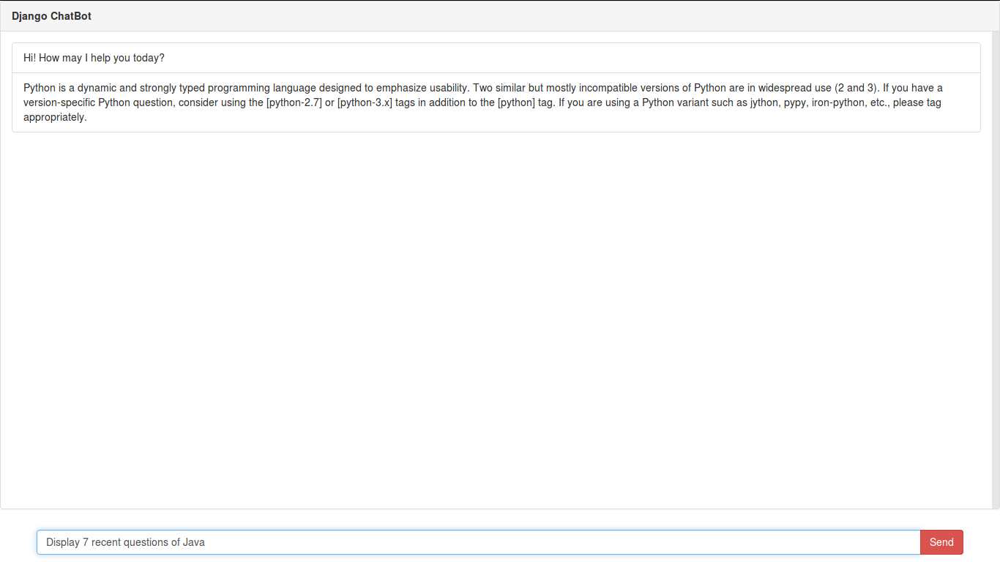
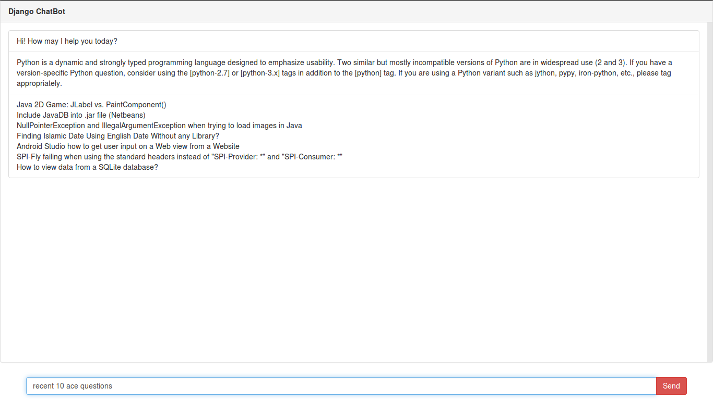
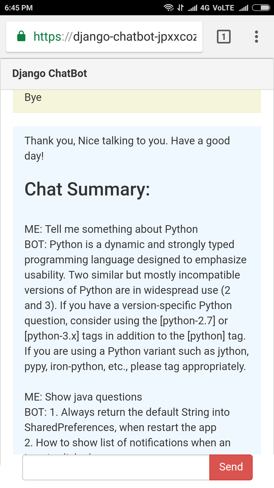

# Django-Chatbot
Django Chatbot using Chatbot AI and Stackexchange api
 
 
Dependencies - python 3.5, chatbotAI 0.1.2.4, django
 
Demo Link: https://django-chatbot-jpxxcozdgn.now.sh/
 
 
# What he knows
- He can tell you about software development tools and terminologies.
- He can show recent questions posted on stackoverflow for specific tag
- He can display recent answered questions posted on stackoverflow for specific tag
- Specify the no. of questions or he will get 5 results.
- He gives Chat Summary when the chat ends.
 
 

# Screenshots
 
 

 
 

 
 

